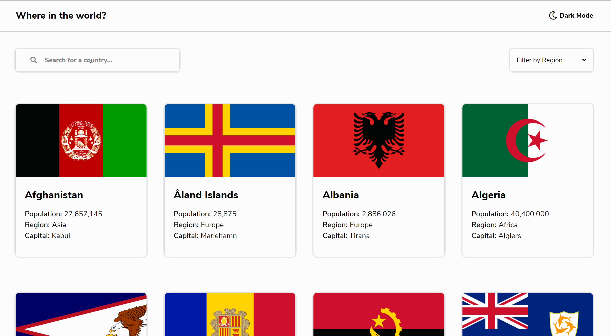

# rest-country-api
REST Country API with Dark Mode.
------------------

This website was built with React Hooks and Router, using styling with Sass.

It gathers data from an API for country information and displays it all in a desktop and mobile-friendly presentation.

View live at: https://foolmonkey.github.io/rest-country-api/
-----------
Preview (GIF)
----

